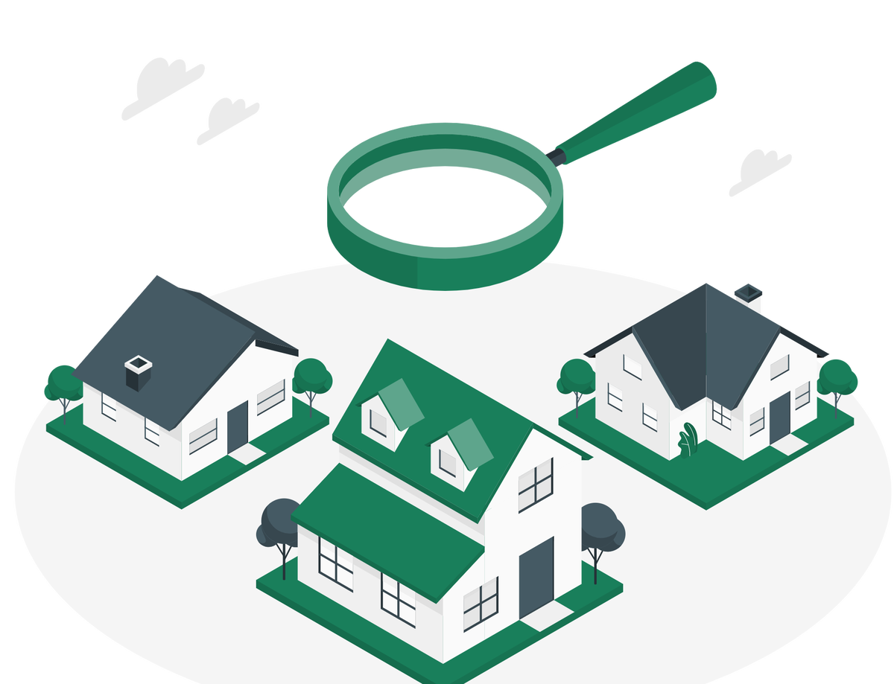
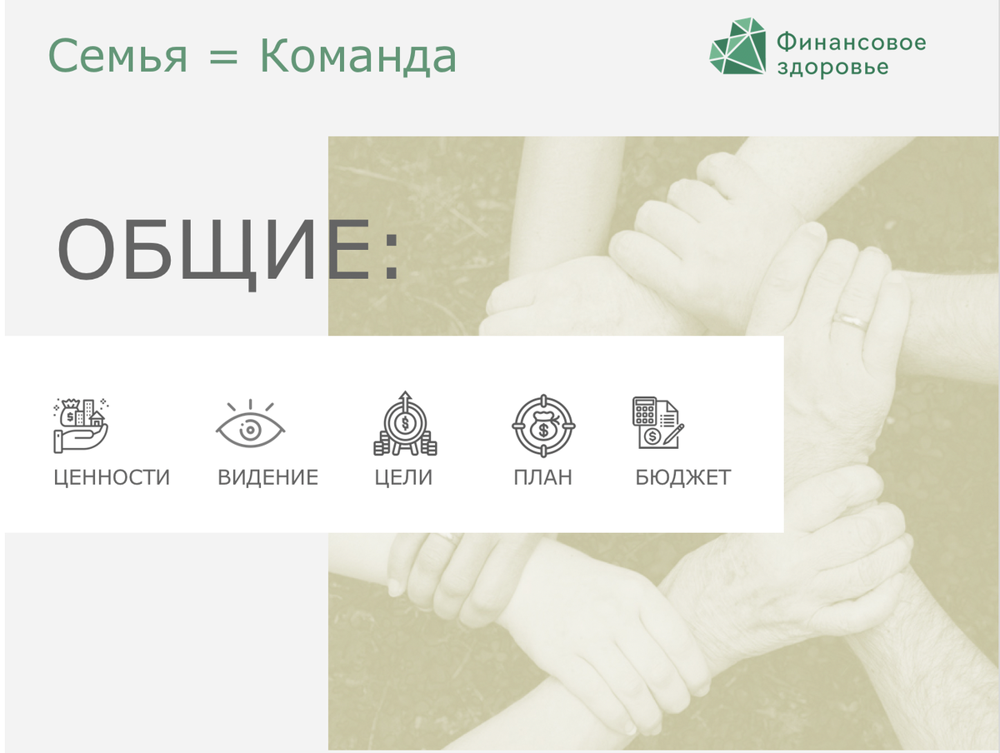

# 01.01 Ваши базовые ценности

_Проработаем базовые ценности, чтобы на их основе сформулировать финансовые цели._

Источник: Finzdorov/GetCourse, lesson id 235010144

## Тема №1. Жизненные финансовые цели: основа финансового благополучия и здоровья

---

_Сергей Макаров, эксперт "Финансового здоровья"_

---

О **важности целей** и способах правильной их постановки написана не одна книга. Не имеет смысла повторять идеи и мысли других авторов, стоит лишь упомянуть, что в случае финансовых целей (то есть жизненных целей, которые можно достигнуть с помощью денег) **важность точной формулировки значительно выше.**

Дело в том, что от **выбора цели зависит то, какие финансовые инструменты нужно использовать для их достижения.**

Неправильный подбор инструмента может привести к весьма **нежелательным последствиям**, например, потере денег.

---

В этом модуле нашего курса вы научитесь определять свои **личные** и **семейные цели**, проверите **их достижимость**.

В результате вы увидите четкую связь между базовыми жизненными **ценностями** и финансовыми **целями**. Найдете свою **мотивацию** для их достижения.

---

## Почему важно определить базовые ценности, прежде чем ставить цели, и как это сделать?

Начните модуль с просмотра видео о **базовых ценностях** и их связи с **финансовыми целями.**

**Видео:** [Rutube](https://rutube.ru/play/embed/98b1d47fb6794e189e48bc2d16496429/?p=YZO74pElZsnRBGF7kooKIQ)

### Таймкод видео

**0.20** О важности постановки финансовых целей в начале пути

**1.05** Как поставить финансовые цели

**2.40** О личных и семейных ценностях

**3.08** Пирамида Дилтса

**4.55** Список ценностей и приоритетов

**5.20** Что такое моделирование предельной ситуации

**7.12** Задание "1 миллион долларов"

---

## Определяемся с ценностями

---

Прежде чем думать о своих целях, а уж тем более искать ответ на вопрос «Куда инвестировать деньги?», необходимо разобраться со своими **ценностями**, то есть тем, **что для вас в жизни по-настоящему важно**.

**Ценности** — это простые и понятные базовые вещи, на которых строится ваше мироощущение и поведение. Они описывают ваши жизненные принципы и способы взаимодействия с окружающим миром.

---

---

Ценности, как правило описываются **простыми словами**, в которые вы вкладываете свой смысл.

**Например**:

- любовь и близость,
- безопасность и покой,
- комфорт,
- счастье,
- веселье,
- здоровье,
- обучение и развитие,
- приключение,
- богатство и успех,
- слава и признание.

Понимание личных ценностей помогает **принимать важные жизненные решения**, в том числе и финансовые.

**Базовые ценности** — это не то, что мы выбираем. Мы открываем их в процессе жизни сами для себя в ситуациях, когда нам приходится совершать какой-то сложный выбор.

---

## Купить квартиру с ипотекой или продолжать снимать...?

---

---

**Знакомый пример?**

Одно из финансовых решений, перед которым нас может поставить жизнь: **покупать квартиру в ипотеку или арендовать?**

С таким вопросом приходят к финансовому консультанту, чтобы разобраться с **экономической целесообразностью этого решения**.

---

Но здесь не всегда нужно принимать решение, основываясь только на финансовой составляющей. Этот вопрос прежде всего стоит осмыслить с точки зрения ценностей. **Что для вас важнее: свобода или безопасность? Мобильность или укорененность?**

Если для вас важнее **свобода**, то, купив квартиру в ипотеку, вы свяжете себя по рукам и ногам, притом будете чувствовать себя дискомфортно.

Если для вас важнее **безопасность** — живя в арендованной квартире, вы будете ощущать себя незащищенным, и это будет вызывать стресс.

**Поэтому, прежде чем ставить себе финансовую цель, стоит разобраться с базовыми ценностями.**

---

## Вы можете пройти психологические тесты, чтобы разобраться со своими базовыми ценностями

- [Тест "Ваши жизненные приоритеты"](./materials/0101-test-vashi-zhiznennye-prioritety.html)

- [Тест "Ваши жизненные ценности"](./materials/0101-test-vashi-zhiznennye-tsennosti.html)

---

**Далее в этом уроке мы хотим предложить вам несколько практических упражнений, которые помогут вам лучше изучить свои ценности и приоритеты.**

В основе этих упражнений лежит методика "Пирамиды Дилтса", о которой вы можете прочитать подробнее в файле

- [Скачать документ](./materials/0101-piramida-diltsa.pdf)

---

## Практическое упражнение №1: Мемуарник

Это упражнение изобрёл **Виталий Королёв**, участник тайм-менеджмент-сообщества Глеба Архангельского, консультант по вопросам корпоративного управления и наследования бизнеса. Изначально оно предназначено для регулярного выполнения в течение года (и даже все жизни). Мы немного трансформировали его, чтобы помочь вам проанализировать прошедшие события.

### Как выполнять упражнение

1. Выделите **30 минут свободного времени** (можно делать этапами/подходами, если сразу не получается вспомнить какие-то вещи).

**2. Запишите в ежедневник** или в отдельную тетрадь **главное событие нескольких дней** на прошлой неделе (далее — **ГСД**), эмоционально значимые для вас. Это необязательно главный результат дня или главное достижение. Самым ярким событием может оказаться, например, пятиминутный разговор с другом. Событие может быть как позитивным, так и негативным. В итоге у вас получится 3-7 таких событий.

_Казалось бы, что за смысл фиксировать негативные события? Однако они могут быть для нас наиболее важными и значимыми, имеющими свою ценность. Например, заболел близкий человек, это всегда для нас самое важное, хотя и самое негативное._

**3.** Сформулируйте главное событие прошлой недели — одно из семи ГСД или какое-то отдельное новое событие. Далее попробуйте вспомнить и сформулировать главные события прошедших месяцев, а также года.

**4.** Итого вы можете составить список примерно из **10 значимых событий** за последние полгода. Рядом с записью о событиях формулируйте ту вашу ценность, на основе которой именно его вы сделали главным.

**5.** Делайте данное упражнение каждый день в течение следующего месяца. Подводите итоги и формулируйте главное событие дня, недели, месяца и присваивайте ему «ценность».

**В итоге вы сможете сформулировать несколько ключевых слов, отражающих ваши ценности. Сохраните их, они нам еще пригодятся.**

**Видео:** [Rutube](https://rutube.ru/play/embed/477ab92b55b45bcebf11bacfa8d771cf/?p=yZBqNPfMJet2PHu_GWIC4w)

---

## Практическое упражнение №2: Приоритеты в целях

Список ценностей у двух разных людей может оказаться одинаковым, но вот **приоритеты** (важность каждой из ценностей) могут различаться.

Если на первом месте стоят «успех» и «приключения», то и видение жизни будет значительно отличаться от того, у кого на первом месте «любовь» и «безопасность».

Как же расставить приоритеты между ценностями в своей жизни?

Сделать это нам поможет подход, который условно можно назвать _**моделированием предельных ситуаций.**_

### Вариант упражнения №1

**Ваша задача** — мысленно поставить себя в ситуацию однозначного выбора между двумя ценностями.

Предположим, вы определили для себя две ценности **«комфорт» и «карьера».**

Теперь представьте, что вам предлагают повышение по службе, но при этом придется сменить город (или даже страну) проживания, выйти из привычного ритма жизни (что в целом дискомфортно).

Решение нужно принимать быстро, поскольку назначение срочное и топ-менеджер, который может согласовать ваше назначение, через 3 часа улетает в длительный отпуск.

Каков будет ваш выбор: **сохранить привычный комфорт или окунуться в новое окружение и новые крутые проекты?**

### Вариант упражнения №2

**Закройте глаза.**

Мысленно представьте, что вы должны **взвесить в своих ладонях две ценности:** на ладони одной руки первую ценность, а на ладони другой — вторую.

Как бы взвесьте их: **какая из них ощущается более весомой, какая рука перевешивает?**

**Полностью сосредоточьтесь на ощущениях.**

То, что **весомее** — для вас сейчас **важнее**. Проделайте такое упражнение несколько раз, чтобы определить приоритеты. **Доверьтесь своей интуиции.**

### Что делать, если ценности конфликтуют?

Если **конфликт** между ценностями решить сложно, то попробуйте подняться на уровень вверх по пирамиде Дилтса и посмотреть, исходя из какого «Я» вы действуете, какой идентичности принадлежат эти ценности.

Скорее всего, **конфликт** находится на более верхнем уровне. То есть конфликтуют, например, не «безопасность» и «свобода», а идентичности «мама» и «предприниматель».

**Чтобы прояснить такой конфликт,** попробуйте обратиться к профессиональному сертифицированному коучу или психологу.

**Видео:** [Rutube](https://rutube.ru/play/embed/21e8b58b239b3055383ac510581f8ef6/?p=LcICp-H5HJHe6Gz3sTnErA)

---

## Практическое упражнение №3: Проявление ценностей

Иногда мы можем выдавать **желаемые ценности за действительные.**

Даже анализ прошлых поступков не всегда спасает, поскольку мы подвержены различным когнитивным искажениям. Например, **эффекту ложных (или придуманных) воспоминаний**. Мы можем «помнить» то, чего с нами вовсе не было.

Поэтому давайте вернемся **к списку наших ценностей** и подумаем, как **они реально проявляются** в нашей жизни и что значит для нас наличие этих ценностей. Для этого мы сделаем вот такое упражнение.

### Как выполнять упражнение

1. Вспомните какой-либо **критерий или ценность,** соответствие которому для вас **значимо** (качество, творчество, уникальность, здоровье и т.д.).
2. Как вы понимаете (поймете), что эта **ценность удовлетворена?** Как она проявляется (проявится) в вашей жизни (в виде реальных событий, поступков, людей, имущества, отношений)?
3. Что именно для вас **доказательство** того, что вы соответствуете этому критерию/ценности?
4. Представьте, что вы **достигли** цели, которая соответствуют выбранному критерию. **Что вы чувствуете?**

**Видео:** [Rutube](https://rutube.ru/play/embed/425c1785b511419e718ebfebbd836efd/?p=aQVR9jRbv3JmzRNw6HBOOg)

---

## О чем еще подумать - семейные ценности

**Конфликты**, связанные с разными ценностями, возникают не только внутри нас, но и **с близкими людьми.**

Это приводит **к спорам** из-за денег (как распоряжаться, что купить, на что копить) внутри семьи. Поэтому, прежде чем задуматься об управлении бюджетом и постановке общих целей, неплохо было бы прояснить то, насколько **совпадают** ваши ценности с членами семьи.

1. Определите важные для вас ценности.
2. Попросите сделать то же самое своих близких.
3. Найдите точки соприкосновения.
4. Сформируйте на их основе общее видение вашей будущей жизни.

---

## Выводы

В заключение этого раздела важно сказать, что ценности и их приоритет **могут (и должны) меняться в течение вашей жизни.**

Сегодня для нас важна карьера, а завтра — семья, сегодня — путешествия, а завтра — стабильность и здоровье.

Наблюдайте за собой, регулярно возвращайтесь к упражнениям, чтобы **актуализировать свои ценности**, **скорректировать финансовые цели** и стратегии их достижения.

---

## Итоговое задание

Надеемся, что те упражнения, которые мы вам предложили в предыдущих разделах, помогли вам прояснить свои базовые ценности.

Но даже если вы их не сделали, ничего страшного. **Главное — сделайте итоговое упражнение, которое впоследствии поможет нам связать ваши ценности с реальными финансовыми целями.**

**Заполните таблицу своих ценностей с помощью упражнения «1M$».**

_Представьте, что у вас есть миллион (десять, сто миллионов) долларов._

- _На что вы его потратите?_
- _Какая потребность стоит за каждой покупкой?_
- _Какой ценности станет больше в моей жизни, если у меня (нас) будет это?_

_Пример того, как может выглядеть таблица, вы найдете ниже._

| Что я куплю на 1 млн. USD (вещ/актив/услуга) | Зачем мне это? | Какая ценность под этим лежит? |
| --- | --- | --- |
| Дом на берегу моря | Хочу жить в теплой стране | Комфорт |
| Инвестиции в недвижимость | Получать пассивный доход | Свобода |
| Porshe | Ездить на дорогой тачке | Понты |
| Отправить детей учится в Англию | Хочу, чтобы они жили в другой стране | Дети, семья |
| Кругосветное путешествие | Хочу посмотреть мир, сделать фотографии разных уголков | Творчество |
| Открою бизнес | Реализовать свою бизнес-идею | Богатство / самореализация |
| Передам часть денег на благотворительность | Помочь больным детям | Благотворительность |

---

- [Скачать документ](./materials/0101-itogovoe-zadanie-1m.docx)
- [Скачать документ](./materials/0101-itogovoe-zadanie-1m.pdf)
