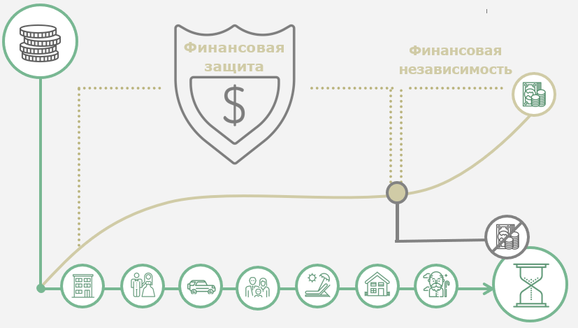
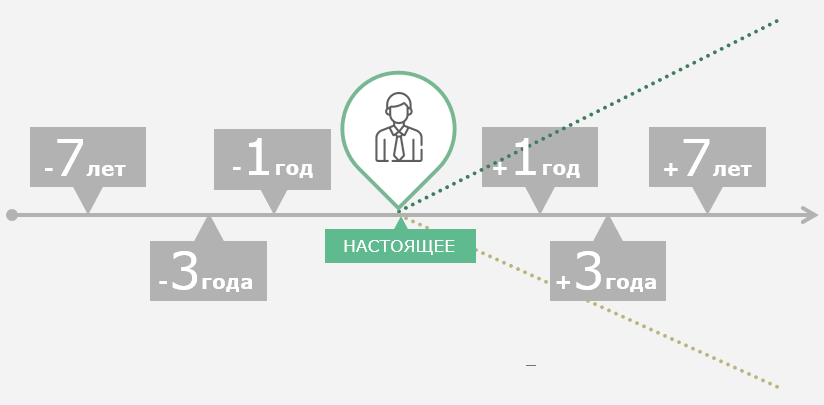

# 01.02 Видение будущего

_Формируем и актуализируем видение вашего будущего_

Источник: Finzdorov/GetCourse, lesson id 235010145

## Тема №2. Как мы видим собственное будущее?

- Что такое **«жизненный цикл»** и как он связан с целями?
- Почему в настоящем моменте в мире необходимо иметь чёткое **видение будущего**?
- Как **описать своё будущее** на основе личных ценностей?

**Видео:** [Rutube](https://rutube.ru/play/embed/053ce3eebdde532a3b55b1d4f667d22b/?p=-R9QmaazPFeanEzTCuw0Ww)

### Таймкод видео

**0.10** Виденье вашего будущего и этапы жизненного цикла

**0.55** Этап создания семьи

**1.24** Третий и четвертые этапы

**2.23** VUCA мир

**3.58** Задачи на будущее

---

## Этапы жизненного цикла

Каждый человек или семья в течение жизни проходят **несколько стадий**, на которых **меняются желания и потребности** отдельных членов семьи (домохозяйства), их **отношение к деньгам** и **планы на будущее.**

---

## Изучите гайд "Этапы жизненного цикла"

- [Скачать документ](./materials/0102-life-cycle-stages-guide.pdf)

---

## Сделайте упражнение "Ваш жизненный цикл"

Подумайте, **на каком этапе жизненного цикла вы находитесь**, а какие еще впереди.

Опишите в свободном формате:

- ключевые жизненные события будущих этапов;
- ваше отношение к деньгам;
- текущие финансовые потребности;
- планы на будущие этапы жизни.

**Видео:** [Rutube](https://rutube.ru/play/embed/3d092f7343e7d7096ce118d8e7f2da92/?p=YWyZYKEowe1xioUo15lgbA)

---

## Прочитайте гайд "VUCA - МИР"

- [Скачать документ](./materials/0102-vuca-world-guide.pdf)

---

## и сделайте упражнение "Виденье будущего"

Важный шаг — **увидеть свое будущее**. Нарисовать видение этого будущего. Буквами, красками, музыкой. Да хоть пальцем на песке.

Где вы живете? Сколько зарабатываете? Кто вас окружает? Какие у вас есть качества, навыки, стратегии? Что для вас важно? И самый главный вопрос: кто вы при этом?

Это важно, поскольку мы строим настоящее из желаемого будущего.

То есть мы строим не будущее и не желаем в настоящем того, чего не заложили в прошлом. **То будущее, которое вы хотите, уже свершилось.** Нужно только его поддержать здесь и сейчас правильными действиями. Прошлое — прямая линия, его не изменить. **Будущее — конус вероятностей**. Ваша задача — наметить в этом конусе опорные точки в виде целей.

**Видео:** [Rutube](https://rutube.ru/play/embed/9fc0bfc5eaf41206f0cdef1fb52ce16c/?p=F8V_6ITEtI6uxBolWsesCA)

---

## Выводы

**Ваше будущее начинается сегодня.** Чтобы жить в том мире, в котором вы хотите, необходимо нарисовать его образ в соответствии с собственными ценностями.

В современном неустойчивом мире особенно важно опираться на самого себя и свои цели, чтобы вас не смыло волнами изменений. Также критически важно уметь быстро корректировать свой взгляд в перспективу. Продолжать смотреть вперёд, а не зацикливаться на сиюминутных проблемах.

---

## Итоговое задание

**Как увидеть это самое будущее?**

Попробуйте сделать следующее упражнение.

Представьте день из своей жизни через **7 лет, 3 года и 1 год.**

Опишите в форме эссе на одной-двух страницах. Чтобы было проще выполнить задание, вы можете использовать уровни пирамиды Дилтса (окружение, действия, способности, идентичность) или вот эти наводящие вопросы:

- С чего начался ваш день?
- Какое самое яркое впечатление дня?
- Где вы находитесь?
- Что и кто вас окружает, о чем говорят люди, находящиеся рядом?
- Как и над чем вы работаете?
- Каких результатов вы достигли?
- Каковы источники ваших доходов?
- Какие проблемы вам удалось решить?
- Как вы отдыхали?
- Каково главное событие дня?

Когда будете писать это небольшое эссе, держите в голове те самые **ценности**, которые вы зафиксировали для себя.

Мысленно проверяйте, соответствует ли ваш образ тем ценностям, которые вы описали.

Выглядеть описание может, например, так:

**1 год:** сегодня ________ 20___ года, мне __ лет.

(Здесь опишите ваше видение через 1 год.)

**3 года**: сегодня ________ 20___ года, мне __ лет.

(Здесь опишите ваше видение через 3 года.)

**7 лет:** сегодня ________ 20___ года, мне __ лет.

(Здесь опишите ваше видение через 7 лет.)

---

- [Скачать документ](./materials/0102-final-assignment.docx)
- [Скачать документ](./materials/0102-final-assignment.pdf)
