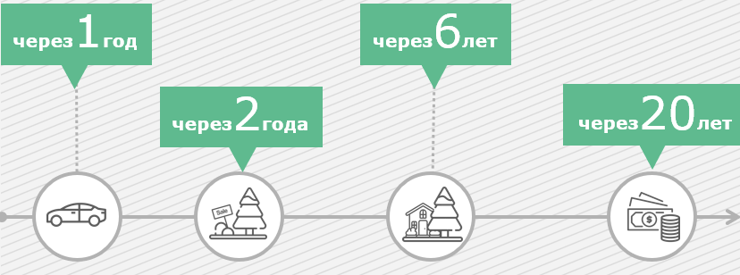
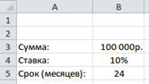
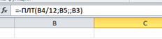
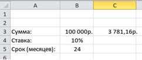
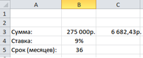

# 01.03 Финансовые цели

_Ставим финансовые цели и рассчитываем необходимые ресурсы_

Источник: Finzdorov/GetCourse, lesson id 235010146

## Тема №3. Формулируем финансовые цели

- **Какие цели** мы перед собой ставим и как они меняются «по жизни»?
- Как **правильно** сформулировать финансовые цели, чтобы затем подобрать **нужные инструменты**?
- Как учесть **инфляцию** и посчитать **будущую стоимость** целей?
- Для чего нужно составить **карту целей** и как проверить их **достижимость**?
- В какой **последовательности** финансировать цели?

Смотрите видео, чтобы найти ответы на вопросы

**Видео:** [Rutube](https://rutube.ru/play/embed/eadd57171a4c3c49aef8b98e1748cfa0/?p=ulfnuQncSSDW5uIdnqh6Og)

### Таймкод видео

**0.10** Типы финансовых целей

**0.40** Цель-расход: категория "рента"

**1.18** Цель-расход: образование, крупные покупки

**1.50** Цель-расход: сумма к сроку

**2.10** Цель-расход: дополнительные цели

**2.22** Типичные цели семьи

**3.15** Практическая работа над целями: линия жизни

**4.15** Параметры финансовых целей

**6.30** Оптимизация финансовых целей

**8.45** Приоритеты в финансировании целей

**9.30** Финальное упражнение к уроку

---

## Изучите конспект "Типы жизненных целей"

- [Скачать документ](./materials/0103-life-goals-types.pdf)

---

## Топ 10 финансовых целей

---

Исходя из нашего опыта, почти все семьи ставят перед собой некоторый **типичный набор целей.**

Вот они:

1. Автомобиль (регулярная смена автомобиля).
2. Недвижимость (новая квартира, смена жилья, загородный дом, дача, зарубежная недвижимость).
3. Рождение ребенка (и компенсация доходов из-за декретного отпуска).
4. Обучение ребенка или свое обучение.

---

---

1. Значимые события: путешествие, юбилей, свадьба.
2. Начальный капитал для открытия собственного бизнеса.
3. Финансовая независимость (возможность не работать).
4. Создание финансовой подушки безопасности.
5. Выплата долгов (например, досрочное погашение ипотеки).
6. Эмиграция, переезд в другую страну.

## Есть ли у вас такие цели?

---

## Практика. Ваши финансовые цели

Давайте перейдем к **практической** работе над вашими целями, чтобы прояснить реальность и понять необходимые финансовые ресурсы для достижения желаемого.

Сначала стоит представить свою **линию жизни** (в этом вам поможет упражнение, которое вы делали, когда исследовали свое видение будущего, а также информация о жизненных циклах и типах целей) и предположить, какие материальные цели могут возникнуть в будущем.

Вы можете **нарисовать линию времени** и разместить ваши цели на ней или составить **таблицу** и расписать последовательность по годам:

| Возраст | Срок | Цель |
| --- | --- | --- |
| 35 | 2021 | Новый автомобиль вместо текущего |
| 36 | 2022 | Покупка земли для строительства дома |
| 40 | 2026 | Строительство дома |
| 54 | 2040 | Финансовая независимость от активного дохода |

Итак, нарисуйте **карту целей** или составьте таблицу.

Помните, что ваши цели должны опираться на те **ценности** и **видение** жизни, над которыми вы работали на предыдущем этапе.

**Обсудите свое видение будущего и цели с вашими близкими людьми.**

В идеале нарисовать карту целей вы должны вместе с женой или мужем, другими членами семьи. Тогда и достигать их будете в **команде**, а это значительно увеличивает вероятность того, что ваши общие мечты сбудутся.

**Пока достаточно простого описания того, чего вы хотите.**

На следующем этапе мы будем придавать цели более точные финансовые очертания. Но прежде чем делать финансовые расчеты, стоит внимательно посмотреть на свои цели и проверить их на соответствие **некоторым критериям.**

Для этого задайте себе несколько вопросов.

- **Найдите смысл.** В этом поможет один вопрос, который можно повторить несколько раз: «Зачем мне эта цель? А зачем мне это? Зачем? Зачем?». Так вы поймете, какой ценности соответствует ваша цели и не является ли она навязанной.
- **Рассмотрите альтернативы.** Подумайте: как еще вы можете удовлетворить потребность, которая лежит за целью?
- **Подумайте о последствиях.** Что у меня будет и чего не будет после достижения цели в финансовом и психологическом ключе?
- **Ресурсы и доступ к ним.** Какие ресурсы вам нужны для достижения цели? Что еще, кроме денег? Чтобы достигнуть цели, чем придется пожертвовать?
- **Препятствия (внешние и внутренние).** Что мешает вам достигнуть цели? Что может помешать? Что не получилось, если вы уже пробовали достигнуть цель? Как можно преодолеть препятствия?

**В результате выполнения упражнения у вас появится примерно такая таблица:**

| Возраст | Год | Цель | Зачем? |
| --- | --- | --- | --- |
| 35 | 2022 | Новая квартира площадью не меньше 85 кв.м. | Чтобы был отдельный рабочий кабинет / отдельные комнаты для детей и т.д. |
| - | - | - | - |
| - | - | - | - |

**Видео:** [Rutube](https://rutube.ru/play/embed/dc838e76ba92c9d7fb73e9f28b0c971b/?p=zNpvHBPKiNtooffKKjFouQ)

---

## Изучите конспект "Финансовые параметры целей"

- [Скачать документ](./materials/0103-financial-goal-parameters.pdf)

---

## и продолжите практику "Ваши финансовые цели"

| Возраст | Срок | Цель |
| --- | --- | --- |
| 35 | 2021 | Новый автомобиль вместо текущего |
| 36 | 2022 | Покупка земли для строительства дома |
| 40 | 2026 | Строительство дома |
| 54 | 2040 | Финансовая независимость от активного дохода |

| Возраст | Год | Цель | Зачем? |
| --- | --- | --- | --- |
| 35 | 2022 | Новая квартира площадью не меньше 85 кв.м. | Чтобы был отдельный рабочий кабинет / отдельные комнаты для детей и т.д. |
| - | - | - | - |
| - | - | - | - |

Продолжим заполнять таблицу, которую начали делать в первом упражнении.

Выберите 3-5 максимально значимых и приоритетных целей и заполните таблицу. Вот как она может выглядеть теперь.

| Год | Возраст | Цель | Зачем | Текщая стоимость | Будущая стоимость | Ресурсы |
| --- | --- | --- | --- | --- | --- | --- |
| 2021 | 35 | Резервный фонд | Чтобы чувствовать себя в безопасности | 900 т. руб. | 1 млн.руб. | 200 т. руб. |

---

## Работа с XLS. Расчет достижимости целей

Когда мы четко представляем свои цели, мы можем прикинуть, сколько денег нам необходимо сберегать (или сколько нужно занять, например, у банка) для их достижения. Точные расчеты лучше производить с помощью программ электронных таблиц (например, Microsoft Excel). Для примера вычислим, какую сумму вам необходимо откладывать под 10% годовых, чтобы накопить 100 000 руб. через 2 года.

1. Введем исходные данные в любые ячейки в программе Excel:

2. Используем функцию ПЛТ (вычисление суммы периодического платежа для аннуитета) с исходными данными из ячеек B3, B4, B5. Для этого в любой ячейке мы должны написать следующее:

3. Полученный результат должен равняться 3 781,16 руб.

Рассчитайте сумму, которую необходимо откладывать для достижения какой-либо вашей цели, используя ту же формулу. Вы можете просто заменить исходные данные, например, так:

Чтобы упростить вам задачу, мы сделали таблицу в Excel, которая автоматически рассчитывает будущую стоимость цели и необходимые ежемесячные отчисления на нее.

**Эту таблицу вы можете скачать ниже**

- [Скачать документ](./materials/0103-goal-calculator.xlsx)

---

**Что делать, если целей много?**

Изучите конспект "Оптимизация целей"

- [Скачать документ](./materials/0103-goal-optimization.pdf)

---

## Выводы

**Финансовые цели** — это товары, объекты, услуги или образ жизни, который можно реализовать с помощью денег.

Чтобы подобрать нужные инструменты достижения целей, необходимо их **сформулировать предельно конкретно,** указав параметры: сроки, суммы, ресурсы.

Чтобы осуществить мечту (цель), вам нужно будет **выделить из семейного бюджета** (доходов семьи) часть денег, которые пойдут не на текущее потребление, а на достижение финансовой цели.

Именно поэтому важно **разумно распоряжаться теми деньгами**, которые приходят к вам в руки, эффективно управлять денежными потоками, распределяя их между повседневными расходами, погашением кредитов и сбережениями.

---

## Итоговое задание

В качестве финального упражнения по этой теме — **составьте таблицу для трех своих целей** по шаблону, который вы можете скачать здесь.

Вам нужно будет интегрировать все, что мы изучили по теме постановки финансовых целей и расписать цели, ответив на следующие вопросы:

- приоритет цели;
- что это;
- зачем вам это;
- когда это нужно;
- стоимость цели (настоящая и будущая);
- текущие ресурсы;
- необходимые ресурсы.

---

- [Скачать документ](./materials/0103-final-assignment.docx)
- [Скачать документ](./materials/0103-goal-calculator.xlsx)
- [Скачать документ](./materials/0103-final-assignment.pdf)
