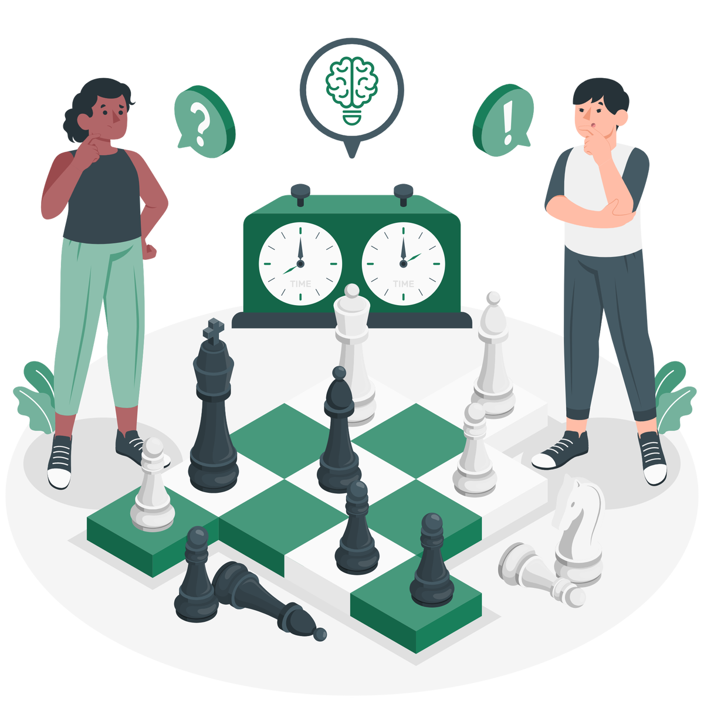

# 01.04. Мотивация достижения целей

_Находим дополнительную мотивацию. чтобы не сойти с дистанции_

Источник: Finzdorov/GetCourse, lesson id 235010147

## Тема №4. Как помочь себе в достижении финансовых целей: мотивация в пути.

- **Почему** важно начать откладывать на цель как можно **раньше**?
- Как выбраться из **мотивационной ямы**?
- Что такое **локус контроля**, как он поможет двигаться к цели и как его вправить, если он «вывихнут»?
- Как правильно использовать **мотивацию и стимулы**?
- Какие **элементы игры** нам пригодятся для ускорения движения к цели?

**Видео:** [Rutube](https://rutube.ru/play/embed/0e09f0bbbc0a86d2545d0b4f0d89f911/?p=ShGrHL1JtedySO6Abmm1wA)

### Таймкод видео

**0.20** Что делать с мотивацией, если цели нереалистичны

**1.05** Пример цели "Образование ребенка"

**2.05** Готовность к изменению плана

**2.50** Что такое мотивационная яма

**3.56** Что такое локус контроля

**5.44** Метод Декарта в мотивации к финансовым целям

**7.30** Главные выводы по теме

---

## Прочитайте конспект "Мотивация и стимул"

- [Скачать документ](./materials/0104-motivation-and-incentive.pdf)

---

## Выполните упражнение "Уровень вашей мотивации"

Возьмите как **минимум одну цель** (возможно, не самую вдохновляющую), которую вы себе поставили, и сделайте следующее:

1. **Оцените** по шкале от 1 до 10 свой уровень мотивации по достижению этой цели.
2. Письменно ответьте на 4 вопроса из **матрицы Декарта**.
3. **Снова оцените** по шкале от 1 до 10. Насколько изменился ваш субъективный уровень мотивации?

Кстати, **не страшно, если уровень мотивации снизился.**

Возможно, это все-таки не самая актуальная для вас цель в данный момент времени и ее стоит пересмотреть.

**Видео:** [Rutube](https://rutube.ru/play/embed/664a20bef149dde459b252427cafe75f/?p=zy5IylK9bQLkuwvO0HDx_g)

---

## Геймификация

---

**Играть любят не только дети, но и взрослые.**

Если ваша цель достаточно большая и вас пугает, для снижения страха можно использовать различные механики геймификации, то есть применять **элементы игры** вне игрового контекста для достижения определенных целей.

Разбейте **цель на уровни** (цепочка уровней или локальных целей, которые приведут к достижению основной цели) и отслеживать прогресс движения по ним. При этом уровней не должно быть много (3-7 этапа). Для каждого из них проще разработать мини-план, проще справиться с небольшими препятствиями.

---

---

Придумайте **вознаграждение** за достижение каждого локального уровня (промежуточной цели). Надо придумать стратегию вознаграждения, в которой прописано, за какие конкретные действия я получу конкретное вознаграждение. Не делать себе случайные награды в процессе достижения цели.

И добавьте **«фана»** 😊 Игра — это всегда немного азарта, движения и веселья.

Например, придумайте **«героя»**, за которого вы играете, дайте ему имя и ведите **дневник его «приключений»** по дороге к цели.

---

## Выводы

Если подвести итог по данной теме, то важно помнить следующее:

- чем раньше мы начнем откладывать деньги на цели, тем лучше;
- на пути к целям могут возникнуть препятствия и мотивационные ямы;
- чтобы выбраться из ямы, нужно:
  - держать фокус внимания на цели;
  - сдвинуть локус контроля внутрь себя, думать о том, что можно сделать для достижения цели;
  - включать мотивацию и стимулы, которые тянут и толкают вперед;
  - использовать инструменты геймификации.

---

## Итоговое задание

Возьмите свою ближайшую **большую цель.** Придумайте для нее маленькую подцель на 1-3 месяца. А теперь заполните таблицу с ответами на вопросы.

- Моя большая цель
- Локальная цель на 1-3 месяца (1-й уровень)
- Что меня не устраивает в текущем положении, почему я хочу его изменить?
- Что меня мотивирует в движении к моей локальной цели?
- Какие действия мне необходимо совершить, чтобы получить нужный результат за 1-3 месяца?
- Какие препятствия могут возникнуть на пути к локальной цели?
- Какие ресурсы мне нужны, чтобы преодолеть эти препятствия?
- Какое вознаграждение я получу за достижение цели?

**Таблицу можно скачать ниже. Приложите заполненную таблицу к ответу на домашнее задание.**

---

- [Скачать документ](./materials/0104-final-assignment.docx)
- [Скачать документ](./materials/0104-final-assignment.pdf)
